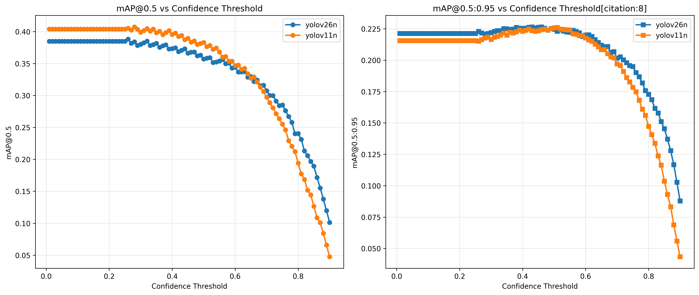

# People Detection Microservice - Тестовое задание
## 🎯 Обзор

Микросервис для сравнения двух моделей детекции людей на видео:
- **YOLOv11n** - легковесная модель детекции объектов от Ultralytics (nano-версия)
- **YOLOv26n** - следующая итерация YOLO с улучшенной скоростью и точностью (nano-версия)

## ⚙️ Установка

### Предварительные требования
- Python 3.12

### Шаги установки

1. **Клонировать репозиторий**
```bash
git clone https://github.com/arturgromenkov/crowd-detection-service
cd crowd-detection-service
```

2. **Создать виртуальное окружение**
```bash
python -m venv venv
source venv/bin/activate  # Linux/Mac
# или
venv\Scripts\activate  # Windows
```

3. **Установить зависимости**
```bash
pip install -r requirements.txt
```

## Воспроизводимость
1. **Запустить сервис напрямую или через докер**
```bash
python src/app.py
# OR
docker compose build && docker compose up
```
2. **Переместиться в папку dev и оттуда выполнять команды, предварительно поменяв путь в скриптах (сам видеофайл с ббоксами я приложу отдельно, он слишком большой)**
```bash
cd dev
# Отредактировать там одну строку
python test_video.py
```

## 📁 Структура проекта

```
crowd-detection-service/
├── data/                          # Директория для данных проекта
│   └── map_vs_confidence.png      # График зависимости F1-меры от порога уверенности
├── dev/                           # Скрипты и утилиты для разработки
│   ├── data/                     # Тестовые данные для разработки
│   ├── results/                  # Результаты тестирования
│   ├── test_image.py            # Скрипт для тестирования на изображениях
│   └── test_video.py            # Скрипт для тестирования на видео
├── docker-compose.yml           # Конфигурация Docker Compose для запуска сервиса
├── Dockerfile                   # Конфигурация Docker-образа
├── README.md                    # Документация проекта
├── requirements.txt             # Зависимости Python-проекта
├── src/                         # Исходный код приложения
│   ├── api.py                  # Основной файл API (FastAPI приложение)
│   ├── app.py                  # Точка входа приложения
│   ├── detector.py             # Главный класс детектора (фасад для моделей)
│   ├── __init__.py            
│   ├── models/                 # Реализации конкретных моделей детекции
│   │   ├── __init__.py
│   │   ├── yolov11n_detector.py  # Детектор на основе YOLOv11n
│   │   └── yolov26n_detector.py  # Детектор на основе YOLOv26n
│   ├── request_types/          # Модели для запросов/ответов API
│   │   ├── __init__.py
│   │   ├── detect_request.py   # Модель запроса на детекцию
│   └── settings.py             # Конфигурация приложения (переменные окружения)
└── tests/                      # Тесты проекта
    ├── data/                   # Тестовые данные (для регрессионного)
    ├── __init__.py             
    └── regression_test.py      # Регрессионный тест
```

## 📊 Результаты

### Визуализация



### Ключевые метрики

| Метрика | YOLOv11n | YOLOv26n | Единицы |
|---------|----------|----------|---------|
| mAP@0.5 | 0.3830 | 0.3569 | доля |
| Precision@0.5 | 0.942 | 0.949 | доля |
| Recall@0.5 | 0.530 | 0.485 | доля |
| Average inference time | 0.031 | 0.026 |  секунд/изображение|

### 🏆 Рекомендуемая модель - **НИКАКАЯ**

Да, YOLOv26N работает быстрее, но немного проигрывает в точности, однако обычно такие модели дообучают и вполне вероятно, она превзойдёт обученную модель YOLOv11n, по крайней мере, об этом говорит генерализированный график сравнения на их сайте, однако, может оказаться так, что РЕАЛЬНЫЕ данные могут сильно отличаться от датасета, что я нашёл на кагле, т.е оптимальную модель можно выбрать только имея на руках ТЗ и более чёткие условия, ну и я даже не тестировал другие размерности моделей, торопился.

### 🚀 Шаги по улучшению
1. **Fine-tuning на доменных данных** - В текущем виде используются фильтры на предсказание, а в идеале иметь дообученную модель на людей

2. **Не успел сделать**
   - Логирование
   - Протестировать другие размерности выбранных моделей
   - Улучшенная обработка requirements.txt, сейчас там излишние библиотеки


